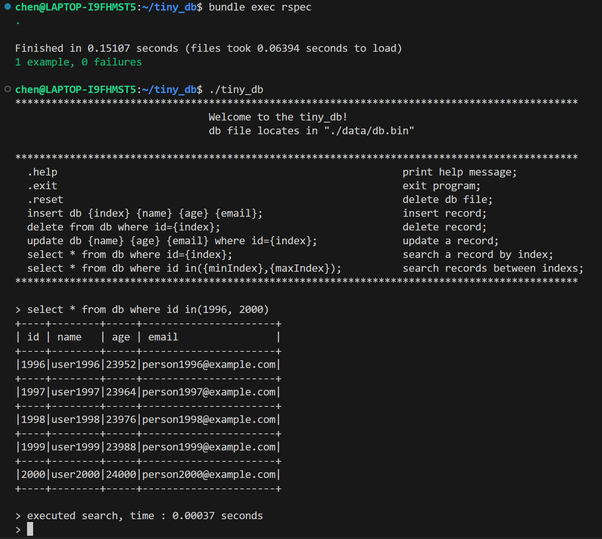

Simple RDBMS based on B+ tree, c/c++
------------------

environment: Ubuntu 18.04

What it does
------------------
This is a simple relational database management system (RDBMS). It supports create, read, update, delete (CRUD) operations with O(log(n)) time complexity, as well as efficient range-based queries. The backend is bolstered by B+ trees, aiming to effectively minimize disk I/O operatons in constrast to red-black trees.

How to run it
--------------------------
1. type "make" to compile, then type "./tiny_db" to run;
2. follow the printed messages to maneuver the database;
3. type ".exit" to quit the program.

The CRUD operations it supports
1. create (insert): insert db {id} {name} {age} {email};
2. read (query): select * from db where id={id};
3. update: update db {name} {age} {email} where id={id};
4. delete: delete from db where id={id};
5. read in range: select * from db where id in({min_id},{max_id});

Example to insert an entry

to query in range

Presently, the database system does not support customized tables, the data must be in the form {id} {name} {age} {email}, where {id} is the primary key, the database is stored at "./data/db.bin".

Test 
---------------------------
Use [rspec](http://rspec.info/) for the test of our RDBMS, insert 2000 rows:
type 'bundle install --binstubs' to install, then type 'bundle exec rspec',

2000 rows inserted in 0.15s, the generated data file is about 2MB, saved in ./data/db.bin
